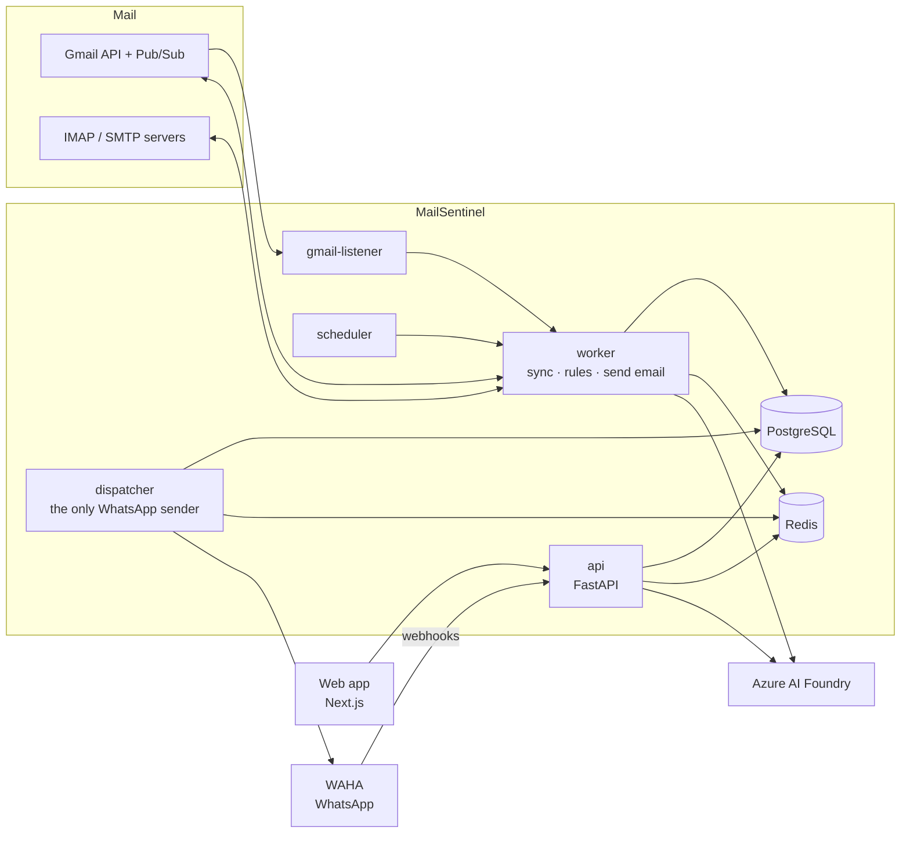

# MailSentinel

**Never miss an important email again.** MailSentinel watches your mailboxes (Gmail and any IMAP account),
decides which new emails matter using rules you write, and sends those to WhatsApp, where you can read them in
full, get their attachments, set reminders and reply. A web app and an AI assistant (Azure AI Foundry) do the
same and more from the browser.

> In depth: **[docs/ARCHITECTURE.md](docs/ARCHITECTURE.md)** explains how every part works and why each
> technology was chosen. The original design record is [docs/DESIGN.md](docs/DESIGN.md); operations are in
> [deploy/README.md](deploy/README.md).

## What it does

**Watches your mail**
- Connect Gmail in one click (OAuth) or any IMAP mailbox (Outlook, Yahoo, college mail…). Gmail updates arrive
  within seconds through Google Pub/Sub; IMAP is checked every minute.
- Rules on any part of an email: sender, domain (with subdomains), recipients, subject, body, headers,
  mailing list, attachments. Combine with AND / OR / NOT, test against your recent mail before saving, or
  describe the rule in plain English and let the AI write it. One-click starter packs (exams, jobs, bank,
  security…).
- Finds dates in important emails (exams, interviews, due dates, calendar invites) and reminds you before them.

**Tells you on WhatsApp, in a readable way**
- Each alert shows who sent it, what it says (an AI summary and a to-do when AI is on), the email's own words,
  attachments and dates, plus a short code like `#K7` to act on it.
- Replies and forwards say so ("Riya replied · 2 earlier messages", "Dad forwarded an email from UPPCL")
  and show only the new text.
- Quiet hours, daily digests, rate limits, and merged bursts so your phone isn't flooded.

**Lets you act from WhatsApp**

| Command | What it does |
|---|---|
| `/open K7` | The full email (split over a few messages if long), its attachments and thread |
| `/thread K7` | The earlier messages of a reply, each with who wrote it and when |
| `/files K7` · `/files K7 2` | The attachments, sent to you as WhatsApp documents |
| `/reply K7` | Three AI reply ideas: answer `1`, `2` or `3`, or `2 mention I'm travelling` |
| `/ideas K7 politely decline` | Reply ideas that follow your own words |
| `/reply K7 say I'll attend` · `/reply K7 manual` | The AI writes it straight away · write it yourself |
| `/write email prof@x.edu asking for leave` · `/edit shorter` | A new email drafted by the AI · change the draft |
| `YES` / `NO` | Send or cancel the draft waiting for confirmation (nothing is sent without it) |
| `/remind K7 2h` · `/mute K7` · `/recent` · `/upcoming` | Remind me later · stop this sender · latest alerts · coming dates |
| `/ask when is my exam?` · `/ask K7 what documents do I need?` | Questions about your mail, or about one email |
| `/email leave` · `/templates` | Send an email from a saved template |

Swipe right on an alert and type just the word (`open`, `reply`, `remind 2h`…) to use its code. `/help` lists
everything.

**On the website**
- Every important email in full, with its own formatting (shown safely, like Gmail), the earlier thread and
  attachments to download.
- An **Assistant** beside each email: ask about it ("what do I need to do?") with answers that stream in as
  short formatted text, or reply: AI ideas you can steer, "write it for me", or write it yourself, then Send.
- Rules, mailboxes, upcoming dates, sent emails, templates and settings; a light and dark theme.
- A separate **admin console** for the operator: clients, WhatsApp pairing, Gmail and AI setup, a test lab,
  a database browser and an audit log.

## How it works



New mail is synced by workers, matched against rules, stored (metadata only, never bodies) and turned into
outbox rows in the same transaction. A single dispatcher sends them to WhatsApp with rate limits and retries.
WhatsApp commands arrive as signed webhooks, run as tasks, and answer through the same outbox. Email is read
live from the mailbox whenever you open it.

## Tech stack

| Layer | Technology |
|---|---|
| Backend | Python 3.13, FastAPI, SQLAlchemy 2 (async) + asyncpg, Alembic, Pydantic 2, Taskiq on Redis Streams |
| Data | PostgreSQL 17, Redis 8 |
| Mail | Gmail API (OAuth, history sync, Pub/Sub push), IMAP (aioimaplib), SMTP (aiosmtplib) |
| WhatsApp | WAHA Core (GOWS engine), self-hosted |
| AI | Azure AI Foundry / Azure OpenAI v1 API (gpt-4.1-mini), JSON mode and streaming |
| Web | Next.js 16, React 19, TypeScript, Tailwind CSS 4, shadcn/ui, TanStack Query, openapi-fetch |
| Safety | nh3 (HTML sanitising), google-re2 (safe regex), Fernet encryption, Argon2, JWT |
| Ops | Docker Compose, Caddy (automatic HTTPS), pull-based autodeploy with rollback, nightly backups |
| Quality | pytest + testcontainers (Postgres, Redis, GreenMail), ruff, pyright, ESLint, tsc, Playwright previews |

Why each was chosen: [docs/ARCHITECTURE.md § Technology choices](docs/ARCHITECTURE.md#4-technology-choices-and-why).

## Run it

### On a server (production)

```bash
git clone https://github.com/rootski1729/Email_manager.git
cd Email_manager/deploy
./mailsentinel.sh install
```

One script installs everything with Docker: web app, API, workers, WhatsApp, database, automatic HTTPS and
nightly backups. Then sign in at `/admin/login`, pair WhatsApp (scan the QR code), and optionally set up Gmail
and the AI assistant from the admin console. `./mailsentinel.sh autodeploy on` deploys new commits on `main`
automatically, with a health check and rollback. Details: **[deploy/README.md](deploy/README.md)**.

### On your computer (development)

Requirements: Docker with Compose v2, [uv](https://docs.astral.sh/uv/) and [pnpm](https://pnpm.io/).

```bash
make env          # deploy/.env with fresh random secrets (including the admin password)
make dev          # postgres, redis, waha, api, worker, scheduler, dispatcher, sandbox mail server
cd frontend && pnpm install && pnpm dev   # http://localhost:3000
```

1. Admin console: http://localhost:3000/admin/login with `ADMIN_USERNAME` / `ADMIN_PASSWORD` from
   `deploy/.env`; pair WhatsApp under **WhatsApp**.
2. Sign in as a client at http://localhost:3000 with your phone number. In development the sign-in code is
   also written to the API log (`make logs s=api`).
3. Connect a mailbox. Without Gmail, use the sandbox: IMAP host `mail-sandbox`, port `3143`, security
   `plain`, any username and password; then `make send-test-mail to=<that address>`.

| URL | What |
|---|---|
| http://localhost:8000/api/docs | API docs (OpenAPI) |
| http://localhost:3001/dashboard | WAHA dashboard |
| http://localhost:9100/metrics | Dispatcher metrics (Prometheus) |

### A visual preview with sample data

`tools/preview/preview.sh` runs the app with realistic sample emails in a local mailbox, a stand-in for the AI
service and WhatsApp in dry-run mode, then takes screenshots in light and dark, desktop and phone. It's how UI
changes are checked before they ship; see the script's header for usage.

## Configuration

Everything has a safe default; the important settings:

| Setting | Where | What |
|---|---|---|
| WhatsApp | Admin → WhatsApp | Scan the QR code with the phone that sends alerts |
| Gmail | Admin → Gmail setup | Google OAuth client; optional Pub/Sub for instant updates (otherwise every 5 minutes) |
| AI assistant | Admin → AI assistant | Azure AI Foundry endpoint, deployment name and key (stored encrypted), with a Test button |
| Secrets | `deploy/.env` | Generated by `make env` / the installer: `JWT_SECRET`, `ENCRYPTION_KEYS`, WAHA keys, admin password |

Users can switch the AI off for themselves in Settings; without it everything works except summaries and AI
replies.

## Repository layout

```text
backend/    FastAPI API, Taskiq workers, WhatsApp dispatcher, rule engine, AI features, tests
frontend/   Next.js web app and admin console
deploy/     Docker Compose files, Caddyfile, install/operate script (mailsentinel.sh)
tools/      Local preview kit (sample emails, AI stand-in, screenshots)
docs/       Architecture (current) and the original design record
```

## Development

```bash
make test       # backend unit + integration tests (Docker needed for Postgres, Redis, GreenMail)
make lint       # ruff + pyright, eslint + tsc
make revision m="describe change"   # new Alembic migration
make openapi    # regenerate the typed frontend API client after changing the API
```

## Privacy and safety in short

Email bodies and attachments are never stored: they're read live from your mailbox when you open an email.
Mailbox credentials and the AI key are encrypted at rest. Emails are shown on the website only after
sanitising, inside a sandboxed frame; remote images wait until you ask. Email text is treated as untrusted
input for the AI, and nothing is ever sent without your explicit YES or Send. More in
[docs/ARCHITECTURE.md § Security and privacy](docs/ARCHITECTURE.md#9-security-and-privacy).
