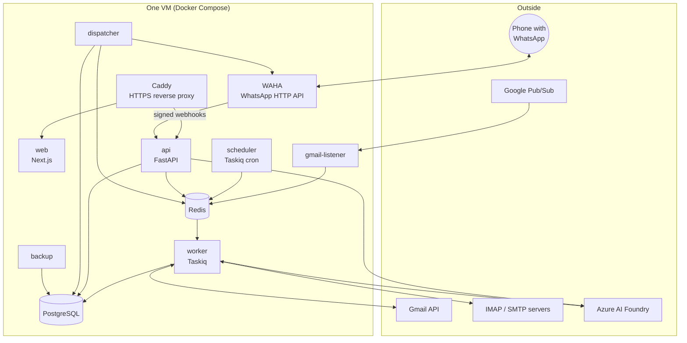
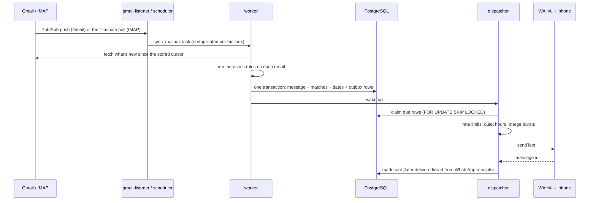

# MailSentinel: how it's built and why

This is the current, in-depth description of MailSentinel: what each part does, how data flows through the
system, which technologies it uses and why they were chosen over the alternatives. For running and operating
it, see the [README](../README.md) and [deploy/README.md](../deploy/README.md). [DESIGN.md](DESIGN.md) is the
original phase-by-phase design record and is kept for history.

**Contents**

1. [The problem](#1-the-problem)
2. [The system at a glance](#2-the-system-at-a-glance)
3. [How the main flows work](#3-how-the-main-flows-work)
4. [Technology choices and why](#4-technology-choices-and-why)
5. [Data model](#5-data-model)
6. [Rules](#6-rules)
7. [Reading emails like a person](#7-reading-emails-like-a-person)
8. [Reliable WhatsApp delivery](#8-reliable-whatsapp-delivery)
9. [Security and privacy](#9-security-and-privacy)
10. [The AI assistant](#10-the-ai-assistant)
11. [The web app](#11-the-web-app)
12. [Deployment and operations](#12-deployment-and-operations)
13. [Testing and quality](#13-testing-and-quality)
14. [Limits and next steps](#14-limits-and-next-steps)

---

## 1. The problem

Important emails (an exam date, an interview invite, a bank alert) get buried among hundreds of others, and
many people, students especially, live in WhatsApp rather than in their inbox. MailSentinel watches every
mailbox a person connects, decides which new emails matter using their own rules, and brings those to
WhatsApp in a form that can be read at a glance. From there the person can read the whole email, get its
attachments, set a reminder, or reply, without opening their mail app. The website offers the same, plus an AI
assistant beside each email.

Design goals, in order:

1. **Never miss, never spam.** An important email must always arrive, exactly once; bursts must not flood the
   phone, and WhatsApp's limits must never get the sending number banned.
2. **Private by default.** Store as little as possible: rules and metadata, never email bodies or files.
3. **Simple to use.** One code per alert (`#K7`), plain words, no setup beyond connecting a mailbox.
4. **Cheap and self-hostable.** Free and open-source parts, one small VM, one install command.

## 2. The system at a glance

One backend image runs as several processes, each with one job:

| Process | Runs | Job |
|---|---|---|
| `api` | FastAPI (uvicorn) | REST API for the web app and admin console, server-sent events, WAHA webhooks |
| `worker` | Taskiq worker | Mailbox syncs, rule matching, WhatsApp command handling, sending email |
| `scheduler` | Taskiq scheduler | Cron jobs: polls, Gmail watch renewal, held alerts, draft expiry, weekly recap, cleanup |
| `dispatcher` | One asyncio loop | The **only** process that sends WhatsApp messages (rate limits, retries, merging) |
| `gmail-listener` | Pub/Sub subscriber | Turns Gmail push notifications into sync requests (optional) |
| `migrate` | Alembic | Applies database migrations before the app starts |
| `web` | Next.js server | The web app and admin console |
| `waha` | WAHA Core (GOWS) | A WhatsApp Web session exposed as an HTTP API |
| `caddy` | Caddy | HTTPS (Let's Encrypt), routing `/api` to the API and the rest to the web app |
| `backup` | postgres-backup-local | Nightly database dumps with rotation |

**Why this shape.** Each process can crash or restart without taking the others down, and each is simple:
the API never blocks on a mailbox, the workers never talk to WhatsApp directly, and exactly one process
decides when a WhatsApp message goes out, which is what makes the rate limits trustworthy. Postgres is the
source of truth and Redis carries everything short-lived (queues, rate-limit buckets, locks, dedupe keys,
live events), so losing Redis loses no data.

## 3. How the main flows work

### 3.1 A new email becomes a WhatsApp alert

- **Finding new mail.** Gmail uses the History API with a stored `historyId`, so each sync fetches only what
  changed. Google Pub/Sub tells MailSentinel within seconds that a mailbox changed: the `gmail-listener` pulls
  from a subscription (no public endpoint needed), or Google can push to the API instead. Watches are renewed
  hourly, and a safety poll runs every 5 minutes in case a notification was lost. IMAP has no push that works
  everywhere, so it's polled every minute using `UIDVALIDITY`/`UIDNEXT` as the cursor.
- **Headers first.** If none of a mailbox's rules look at the body, only headers are fetched to decide; the
  full email is loaded once a message matches (for the preview, dates and the AI summary). Matched emails are
  stored as metadata (sender, subject, a short preview, rule names, a short code), never the body.
- **Exactly once.** `(mailbox_id, provider_message_id)` is unique, inserts use `ON CONFLICT DO NOTHING`, and a
  sync's cursor advances only after its work is committed, so a crash replays safely without duplicates.
- **The transactional outbox.** The alert is written as a `notifications` row *in the same transaction* as the
  message. Either both exist or neither does, so an alert can't be lost between "matched" and "queued", and
  the dispatcher can retry it for as long as needed.
- **Dates and reminders.** Calendar invites (`.ics`) and dates written in the text ("exam on 15 October at
  10 AM") become events; confident ones schedule WhatsApp reminders, unsure ones ask for confirmation in the app.
- **AI summary.** When AI is on, the worker asks for a one-line summary and a to-do (with a 30-second limit);
  if the AI is slow or fails, the alert simply goes without it.

### 3.2 A WhatsApp command

1. The person messages the bot (or their own "Message yourself" chat). WAHA calls the API's webhook, signed
   with HMAC; the API checks the signature and queues the message for a worker.
2. The worker deduplicates by message id, identifies the sender by phone number (handling WhatsApp's `@lid`
   ids and the self-chat), and ignores the bot's own echoes and messages in other chats.
3. The text is parsed into a command (`/open K7`, `remind 2h` on a quoted alert, `2 mention I'm travelling`
   after reply ideas…). Codes like `K7` map to the user's alerts.
4. The handler answers by adding `reply` rows to the same outbox, so replies obey the same rate limits and
   retries as alerts.
5. `/files` stages each attachment in Redis for 15 minutes (base64) and queues a reply that refers to it; the
   dispatcher sends it with WAHA's `sendFile` and deletes it. Files never touch the database.

### 3.3 Replying or sending an email

- A draft is created as an `outbound_emails` row **awaiting confirmation**, with a 10-minute expiry. On
  WhatsApp, nothing is sent until the person answers `YES`; on the website, until they press Send.
- Replies thread correctly: `In-Reply-To` and `References` come from the original message's `Message-ID`, the
  subject keeps the conversation's subject (`Re: …`), and Gmail replies go into the same Gmail thread.
- A worker sends it from the person's own mailbox: through the Gmail API (if they granted sending) or SMTP.
  Daily email limits apply per plan.

### 3.4 Opening an email in full

Bodies are never stored, so opening an email reads it **live** from the mailbox (`load_full` on the provider),
then:

- [Reading](#7-reading-emails-like-a-person) separates what's new from the quoted thread and recognises forwards.
- The HTML version is sanitised (§9) and shown in a sandboxed frame; remote images wait for "Show images".
- Attachments are listed and downloaded through the API, again read live from the mailbox.

### 3.5 Asking the AI

The browser posts the question to a streaming endpoint; the API reads the email live, sends it to Azure AI
Foundry with the email marked as untrusted data, and relays the answer as server-sent events. The web app
types it out as it arrives. Details in [§10](#10-the-ai-assistant).

## 4. Technology choices and why

| Need | Choice | Why | Alternatives considered |
|---|---|---|---|
| API | **FastAPI** + Pydantic 2 | Async from end to end (mail, Redis, HTTP all I/O-bound), request validation and an OpenAPI schema for free, which generates the frontend's typed client | Django (sync-first, heavier), Flask (no typing/validation built in) |
| Database | **PostgreSQL 17** | Transactions for the outbox pattern, `JSONB` for rule conditions and payloads, `FOR UPDATE SKIP LOCKED` for safe concurrent claiming, arrays for addresses | MongoDB (weaker transactions), MySQL (weaker JSON and locking features) |
| ORM / migrations | **SQLAlchemy 2 (async) + asyncpg, Alembic** | Mature, typed, async; Alembic autogenerates migrations and checks for drift | Tortoise/SQLModel (smaller ecosystems) |
| Short-lived state | **Redis 8** | Queues (Streams), token-bucket rate limits in Lua, locks, dedupe keys with TTLs, pub/sub for live events, one tool for all of it | RabbitMQ + Memcached (two systems instead of one) |
| Background jobs | **Taskiq** on Redis Streams | Native asyncio (Celery's async support is limited), cron scheduling built in, lightweight | Celery, RQ, Arq |
| Gmail | **Gmail API + Pub/Sub** | Real push within seconds, incremental History API, threaded sending, OAuth (no passwords) | IMAP on Gmail (no push, app passwords) |
| Other mail | **IMAP / SMTP** (aioimaplib, aiosmtplib) | Works with every provider; async | Provider-specific APIs (one per provider) |
| WhatsApp | **WAHA Core**, self-hosted, GOWS engine | Free, open source, no per-message fees, media sending since 2026.6; the GOWS engine is lightweight (no browser) | WhatsApp Business Cloud API (business verification, template approval, per-conversation pricing), Twilio (paid) |
| AI | **Azure AI Foundry** (Azure OpenAI v1 API), `gpt-4.1-mini` | Same API shape as OpenAI, pay-per-use, regional deployment, built-in content safety (Prompt Shields), runs on the project's Azure account | OpenAI directly, self-hosted models (hardware cost) |
| Web app | **Next.js 16**, React 19, TypeScript | App Router, server rendering where useful, a standalone server image for Docker, also deployable to Vercel | Plain React SPA, Vue |
| UI | **Tailwind CSS 4 + shadcn/ui** | Accessible primitives owned in the repo (no locked-in library), design tokens in one CSS file, light and dark themes | MUI, Chakra (heavier, harder to restyle) |
| Data fetching | **TanStack Query + openapi-fetch** | Caching, retries and invalidation; the API client is generated from the backend's OpenAPI schema, so the types can't drift | Hand-written fetch wrappers |
| HTML safety | **nh3** (ammonia, Rust) + lxml | A fast, allow-list sanitiser maintained by the Rust ecosystem, with CSS property filtering; lxml to remove quoted history | bleach (deprecated) |
| Regex in rules | **google-re2** | Linear-time matching, so a user's regex can't freeze a worker (no catastrophic backtracking) | Python `re` |
| Secrets at rest | **Fernet** (`cryptography`), MultiFernet | Authenticated encryption with key rotation (`ENCRYPTION_KEYS` holds old and new keys) | Database-level encryption (all-or-nothing) |
| Passwords | **Argon2** | Current best practice for password hashing (admin accounts) | bcrypt |
| Retries | **stamina** | Exponential backoff with jitter, well-tested defaults | Hand-written loops |
| Logging / metrics | **structlog**, Prometheus client | JSON logs with request ids; dispatcher metrics on `/metrics` | — |
| Hosting | **One Azure VM + Docker Compose + Caddy** | Cheapest option that runs everything (WAHA needs a long-running process), automatic HTTPS, easy to move to any VM | Kubernetes (overkill for one VM), serverless (WAHA and the dispatcher are long-running) |

## 5. Data model

PostgreSQL tables (migrations in `backend/migrations/`):

| Table | Holds |
|---|---|
| `users`, `user_settings` | Client accounts (phone number), timezone, quiet hours, digest, daily cap, muted senders, AI and email-from-WhatsApp switches |
| `refresh_tokens` | Hashed, rotating sign-in tokens grouped in families (reuse detection) |
| `destinations` | Verified WhatsApp chats an alert can go to |
| `mailboxes` | Provider, address, **encrypted** credentials, sync cursor, status and errors |
| `rules` | Name, condition (JSONB), actions (who to notify, instant/digest, urgent), counters |
| `messages`, `rule_matches` | One row per matched email: metadata, short preview, AI summary, short code; which rules matched |
| `events` | Dates found in emails (exam, interview, deadline, payment, travel…) and their status |
| `notifications` | The outbox: every WhatsApp message to send, with status, attempts and timing |
| `email_templates`, `outbound_emails`, `outbound_attachments` | Emails sent from WhatsApp or the website, and their drafts |
| `admin_accounts`, `admin_sessions`, `admin_audit` | The operator console's own accounts and an audit log |
| `app_settings` | Settings changed at runtime (Google, AI), with secrets encrypted |

**What is never stored:** email bodies and attachments (read live when needed; a short preview is kept for
the alert), WhatsApp message contents beyond the outbox text, and AI conversations (they live in the browser).

## 6. Rules

- Every email is normalised into an **envelope**: sender, domain, recipients, subject, body, headers, mailing
  list, attachments.
- A **condition** is a JSON tree validated by Pydantic: groups (`all`, `any`, `not`) of predicates such as
  `{"field": "from.domain", "op": "domain_matches", "value": ["univ.edu"]}`. Operators include `contains`,
  `contains_all`, `equals`, `starts_with`, `ends_with`, `domain_matches` (with subdomains), `regex` (RE2),
  `exists` and `is`.
- Conditions are **compiled once** per sync and evaluated cheaply; header-only rules never need the body.
- A rule can be **tested against recent mail** before saving, created from **starter packs** or from a
  **suggestion** based on the user's actual inbox, or written by the AI from a plain-English description (the
  AI's output is validated with the same schema and retried once if invalid).

## 7. Reading emails like a person

`app/providers/reading.py` turns an email body into what a person would want to read:

- **Replies:** the new text is separated from the quoted history ("On … wrote:", Outlook's "From: … Sent: …"
  block, "> " quotes), and the earlier messages are split into a list with who wrote each and when.
- **Forwards:** the forwarder's note, who wrote the original, its subject and its text are separated, so an
  alert says "Dad forwarded an email from UPPCL Billing" instead of showing forward headers.
- **Plain text vs HTML:** when the plain-text part is a stub ("view this email in your browser") the HTML's
  text is used instead.
- **Previews** skip greetings, signatures, footers and link-only lines.

`app/notify/wa.py` lays everything out for WhatsApp: compact quotes without empty lines, long text split into
readable parts on paragraph boundaries, file lists that ignore signature logos, and user text escaped so it
can't break WhatsApp's formatting.

## 8. Reliable WhatsApp delivery

WhatsApp numbers that send too much, too fast, get restricted, so all sending goes through one place.

- **One dispatcher.** It claims due `notifications` with `SELECT … FOR UPDATE SKIP LOCKED`, so it could be
  scaled out later without double sends; in practice one is enough.
- **Rate limits** (token buckets in Redis, atomic Lua): a global limit (20/min, bursts of 5), a per-chat limit
  (6/min) and a per-user daily cap from the plan. System messages (sign-in codes, replies) skip the daily cap.
- **Human-like pacing:** a typing indicator and a random 0.8–2.5 s pause before each message.
- **Merging:** alerts for the same chat within an 8-second window are sent as one message.
- **Quiet hours and digests:** alerts are held and released later (urgent rules skip quiet hours).
- **Retries:** failures retry with exponential backoff (30 s doubling, up to 30 min) for up to 6 attempts,
  then go to `dead` with a Retry button in the app. A circuit breaker pauses sending for a minute after 5
  failures in a row, so a broken WhatsApp session isn't hammered.
- **Receipts:** WAHA's delivered/read acknowledgements update each notification.
- **Echo protection:** messages the bot sends are remembered (ids and text), so they're never mistaken for
  commands, which matters when the bot uses the person's own number and their self-chat.

## 9. Security and privacy

- **Client sign-in:** a one-time code sent on WhatsApp (5 minutes, 5 attempts, 3 requests per 15 minutes per
  number plus a per-IP limit; optional Cloudflare Turnstile). Sessions use a 15-minute JWT access token and a
  30-day refresh token in an `httpOnly` cookie that **rotates on every use**; reusing an old one revokes the
  whole family (stolen-token detection). The access token lives only in memory.
- **Admin console:** separate accounts with Argon2 passwords, lockout after 5 failures, its own rotating
  sessions, and an audit log of every change.
- **Secrets at rest:** mailbox credentials (OAuth tokens, IMAP/SMTP passwords) and the AI key are encrypted
  with Fernet; `ENCRYPTION_KEYS` supports rotation. Secrets are never returned by the API or written to logs.
- **Webhooks:** WAHA's calls are verified with an HMAC signature; internal routes aren't exposed through Caddy.
- **Showing email HTML:** sanitised on the server with an allow-list (no scripts, forms, frames, event
  handlers, `javascript:` links or positioning CSS), then rendered in an iframe with `sandbox` (no scripts), a
  strict Content-Security-Policy (no network except images the reader allows), `no-referrer`, and links that
  open in a new tab. Remote images (often tracking pixels) are held back until "Show images". Downloads of
  types a browser could render (HTML, SVG, XML) are served as plain downloads with `nosniff`.
- **AI:** email text is passed inside `<email>` tags with an instruction to treat it as data; Azure's Prompt
  Shields filter adds another layer. The AI can only *suggest*: nothing is sent without the person's YES or
  Send. Users can switch AI off.
- **Limits per plan:** mailboxes, rules, daily alerts and daily emails are capped to prevent abuse.
- **Transport:** HTTPS everywhere through Caddy with HSTS; the database and Redis are not exposed outside
  Docker's network.

## 10. The AI assistant

- **Provider:** Azure AI Foundry through the OpenAI-compatible v1 API (`{endpoint}/openai/v1/chat/completions`,
  `api-key` header for Azure hosts). Endpoint, deployment and key are set in the admin console (key stored
  encrypted) and every process picks up changes without a restart (a version counter in Redis).
- **Features** (`app/ai/features.py`):

  | Feature | Output | Used by |
  |---|---|---|
  | Summary | one or two sentences, a to-do, importance (JSON) | WhatsApp alerts, mail list |
  | Reply ideas | three labelled ideas, optionally following the person's own words (JSON) | `/reply`, `/ideas`, website |
  | Draft / revise | subject and body; replies always keep the conversation's subject (JSON) | WhatsApp and website |
  | New email | recipients, subject, body; addresses validated (JSON) | `/write`, website |
  | Rule from text | a condition validated against the rule schema, retried once if invalid (JSON) | Rules page |
  | Questions | a short Markdown answer: direct answer, at most 4 bullets, bold only for key facts, about 70 words (streamed) | Assistant, `/ask` |

- **Structured output** uses JSON mode and tolerant parsing; every feature raises one error type, so callers
  fall back gracefully (an alert without a summary, the manual reply form).
- **Streaming:** questions stream as server-sent events (`delta` … `done`/`error`). Azure's content filter
  releases text in bursts, so the web app types out whatever has arrived at a steady pace; Stop keeps what's
  on screen. Caddy is configured with `flush_interval -1` so streams aren't buffered.
- **Cost control:** small max-token limits per feature, short prompts, and no AI call unless the person or
  an alert needs one.

## 11. The web app

- **Next.js App Router** with client components for the interactive pages; the API is proxied through
  `/api` so the refresh cookie stays first-party.
- **Typed API:** `pnpm gen:api` turns the backend's OpenAPI schema into TypeScript types used by
  `openapi-fetch`, so a backend change that breaks the frontend fails the type check.
- **Live updates:** one server-sent-events stream per user (Redis pub/sub) refreshes lists and statuses.
- **Pages:** Home (status, setup steps, ask box), Important mail (list with an assistant on wide screens),
  each email (full email, thread, attachments, Assistant: Ask and Reply), Upcoming, What to watch (rules),
  Mailboxes, Send email (templates, sent), WhatsApp destinations, Settings; and the admin console (overview,
  clients, mailboxes, rules, WhatsApp, Gmail setup, AI assistant, test lab, database browser, audit log).
- **Design system:** the "Iris" theme (white surfaces, cool greys, one violet accent) as CSS variables with a
  dark variant; shadcn/ui primitives; text contrast checked against WCAG AA; motion respects "reduce motion".

## 12. Deployment and operations

- **Install:** `deploy/mailsentinel.sh install` checks requirements, generates secrets into `deploy/.env`,
  builds the images and starts everything with Docker Compose (`compose.yml` + `compose.prod.yml`). Caddy
  obtains HTTPS certificates automatically.
- **Pull-based autodeploy:** a systemd timer on the VM runs every 2 minutes. When `main` has a new commit it
  fetches it, backs up the database, rebuilds and restarts (`docker compose up -d --build`), waits for health
  checks and reloads Caddy. If the new version isn't healthy it **rolls back** to the previous commit and
  skips the bad one. Nothing connects into the VM and no cloud credentials live in GitHub. With
  `AUTODEPLOY_REQUIRE_CI=true` it deploys only commits whose GitHub checks passed.
- **Backups:** nightly `pg_dump` with rotation (`backup` service), plus a backup before every deploy;
  `mailsentinel.sh restore` restores one.
- **Observability:** JSON logs with request ids (secrets and cookies redacted, also in Caddy's access log),
  Prometheus metrics from the dispatcher, and a health page in the admin console (database, Redis, WhatsApp
  session, workers, Gmail, AI).
- **CI:** GitHub Actions runs ruff, pyright and the full test suite, the frontend lint and build, and builds
  the Docker images on every push.

## 13. Testing and quality

- **Backend tests** (pytest): unit tests for the rule engine, parsers, reading, WhatsApp layouts, HTML
  sanitising and AI features (with a fake model); integration tests that start real **PostgreSQL, Redis and
  GreenMail** (a mail server) in Docker with testcontainers and run whole flows: sync → match → alert,
  WhatsApp commands, sending email over SMTP and checking it over IMAP, the AI flows, streaming, downloads.
- **Static checks:** ruff and pyright (backend), ESLint and `tsc` (frontend); `alembic check` confirms the
  models and migrations agree whenever the schema changes.
- **Visual checks:** `tools/preview/` runs the real app with sample emails, a stand-in AI that really streams,
  and WhatsApp in dry-run mode, then takes Playwright screenshots in light and dark, desktop and phone. UI
  changes are reviewed this way before they ship.

## 14. Limits and next steps

- WAHA uses WhatsApp Web; it's free but unofficial, so the sending number should be a dedicated one.
- IMAP mailboxes are polled every minute rather than pushed.
- The AI only sees the email being discussed (or a short list of recent important emails for `/ask`); it
  doesn't search the whole mailbox.
- Possible next steps: an MCP server so outside AI assistants can use MailSentinel's tools; Microsoft Graph
  for push on Outlook mailboxes; per-rule AI classification ("is this email about my exams?").
