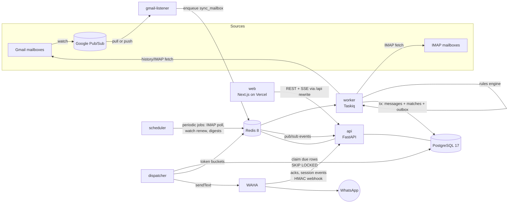

# MailSentinel — Design

> Status: **implemented (v0.1)** · Last updated: 2026-10-05 · See §18 for what changed during implementation
> Working name for the rewrite of "EmailFilter Pro". The name can change; nothing depends on it.

## 1. Problem and goals

People subscribe to many mailboxes (personal Gmail, college/work accounts, alternate addresses). Important mail
such as exam schedules, admit cards, interview calls or bank alerts gets buried. MailSentinel watches every
connected mailbox, runs each new message through user-defined rules, and pushes matches to WhatsApp through a
self-hosted [WAHA](https://waha.devlike.pro/) instance.

**Goals**

1. Connect many mailboxes per user: Gmail first, plus any IMAP mailbox (Outlook/Yahoo/Zoho/college servers).
2. Rules that can target **any part of a message**: sender address/name/domain/**subdomain**, recipients,
   subject, body, any raw header, attachments, list-id, mailbox. Combine them with AND/OR/NOT.
3. Delivery to WhatsApp that is **reliable and never trips WhatsApp/WAHA limits**: a durable queue, global and
   per-recipient rate limits, retries, dead-lettering, and bursts merged into one message.
4. A monitoring frontend that shows mailbox health, the matched-mail feed, delivery status and queue state live.
   Deployable on Vercel.
5. Everything runs with `docker compose up`, in development and on a production host.

**Non-goals for v1:** sending or replying to email, a full mail client, mobile apps, billing (deferred, see §13).

## 2. Audit of the current code

The existing backend (`backend/`) is a FastAPI + Celery prototype. These defects drive the rewrite; most are
structural rather than one-line fixes.

| # | Area | Finding | Impact |
|---|------|---------|--------|
| 1 | Gmail push | `users.watch()` is called once at connect time and **never renewed** (`gmail_service.py`). Gmail watches expire after 7 days. | Notifications silently stop for every mailbox after a week. |
| 2 | Webhook security | `/webhooks/gmail` accepts any POST; there is no Pub/Sub OIDC token check (`webhooks.py`). | Anyone can trigger syncs for any mailbox. |
| 3 | OAuth security | OAuth `state` is the literal `user_{id}` (`google.py`). | Anyone can attach their Gmail to another user's account (OAuth CSRF). |
| 4 | Concurrency | No per-mailbox lock. Two webhooks for the same mailbox read the same `last_history_id`, process the same range, and race to overwrite the cursor. | Duplicate or missed messages. |
| 5 | Async misuse | The sync `googleapiclient` and `credentials.refresh()` are called inside `async` code. Celery tasks wrap coroutines with `get_event_loop().run_until_complete` on `--pool=solo`. | Blocked event loop, one task at a time, fragile asyncpg loop binding. |
| 6 | Rate limiting | Celery `rate_limit='30/m'` is **per worker process**, not global. Nothing tracks per-recipient volume. | Scaling workers multiplies the WhatsApp send rate, which risks a ban. |
| 7 | Delivery tracking | Notifications are fire-and-forget Celery tasks with no table, status, dedup or dead-letter queue. | Lost alerts are invisible. Retries can send duplicates. |
| 8 | Redis usage | `get_user_filters` caches the string `"1"` and always re-queries the DB. `redis_manager.set/get/delete` are called in `whatsapp_service.py`, but those methods don't exist. | The cache does nothing, and phone verification crashes. |
| 9 | OTP | The code is embedded in the Redis key, with no verify-attempt limit. `slowapi` is configured but no route is decorated. | A 6-digit OTP can be brute-forced. |
| 10 | Models | `default=datetime.now(timezone.utc)` is evaluated once at import (`models.py`). | Every row gets the process start time. The "skip emails older than the filter" logic compares against a wrong timestamp. |
| 11 | Filter engine | A fixed `filter_type` enum, at most 3 values per field, substring-only matching. `sender_domain` uses substring (so `abc.com` matches `notabc.com`). No header, regex, NOT, or per-mailbox scoping. First match wins. | Can't express the rules the product is about. |
| 12 | Data model | `filtered_emails.gmail_message_id` is globally unique instead of unique per mailbox. Gmail-only columns sit on the mailbox table. | Blocks multi-provider support. |
| 13 | Tokens | Google may omit `refresh_token` on re-consent, and `encrypt(None)` then crashes. Access tokens are refreshed with blocking calls. JWTs use the unmaintained `python-jose`, and refresh tokens can't be revoked. | Reconnect failures, no logout. |
| 14 | Ops | Compose has no Postgres/Redis services. 14 Alembic revisions with duplicate names and a merge head. `print()` logging, no tests, the notification link is hard-coded to `localhost`, and the README describes a Chrome extension that isn't in the repo. | Not reproducible or operable. |

**Decision:** rewrite rather than refactor. Keep the good ideas: WhatsApp OTP login (it proves the user owns
the destination number), Gmail History API incremental sync, Fernet-encrypted credentials, and Turnstile on
login. The legacy code stays reachable through git history.

## 3. Architecture



### Services (one image for the backend, several entrypoints)

| Service | Role | Scales |
|---------|------|--------|
| `api` | FastAPI: REST, SSE stream, Gmail push/WAHA webhooks, OAuth callback | horizontally |
| `worker` | Taskiq workers: mailbox sync, rule evaluation, token refresh, watch renewal | horizontally |
| `scheduler` | Taskiq scheduler: periodic jobs (single instance) | 1 |
| `dispatcher` | Notification outbox drain loop with global rate limiting | 1 active (Redis leader lock) |
| `gmail-listener` | Pub/Sub **pull** subscriber, so it works locally with no public URL. Not needed in push mode. | 1 |
| `migrate` | One-shot `alembic upgrade head` before the other services start | job |
| `postgres` | System of record | — |
| `redis` | Queue broker, locks, rate limits, cache, pub/sub | — |
| `waha` | WhatsApp HTTP API with a persistent session volume | 1 |
| `web` | Next.js frontend. Deployed to Vercel, with an optional container for local dev. | — |

### Why this shape

- **The Postgres outbox is the source of truth for notifications.** The message row, the rule matches and the
  notification row are written in **one transaction**, so a crash can't lose an alert or send one for an
  uncommitted match. Redis only carries work and limits; losing Redis delays alerts but loses none.
- **A single dispatcher owns the WhatsApp send rate.** A global token bucket in Redis (Lua, atomic) enforces the
  limit regardless of how many workers produce alerts. That fixes defect #6 at its root.
- **Bursts are coalesced into one sync.** Gmail can fire many push notifications for one burst of mail. The
  listener sets `sync:pending:{mailbox}` with `SET NX` and enqueues only once, and the worker holds a
  per-mailbox lock. That fixes #4.

## 4. Technology choices

| Concern | Choice | Reason |
|---------|--------|--------|
| Backend language | Python 3.13 | Continuity with the existing code and a mature Google/IMAP ecosystem |
| Packaging | `uv` with a lockfile | Fast, reproducible installs, used in Docker too |
| Web framework | FastAPI + Pydantic v2 | Typed contracts, OpenAPI for generating the frontend client |
| ORM / migrations | SQLAlchemy 2 (async, `asyncpg`) + Alembic, one clean baseline migration | Replaces 14 broken revisions |
| Database | PostgreSQL 17 | JSONB for rule trees, `SKIP LOCKED` for the outbox |
| Queue | **Taskiq** + `taskiq-redis` stream broker (consumer groups, acks) | Async-native, unlike Celery (#5). Has retries and a scheduler. |
| Redis | Redis 8 | Broker, locks, token buckets, cache, pub/sub |
| Gmail | Gmail REST through an async `httpx` client; Pub/Sub pull (dev) or authenticated push (prod) | No blocking client library, and full control over retries |
| IMAP | `aioimaplib`, UIDVALIDITY/UID cursor | Covers non-Gmail providers |
| Regex | `google-re2` | Linear-time matching: user regexes can't ReDoS the worker |
| Auth | WhatsApp OTP → short-lived JWT access token (PyJWT) + rotating refresh token in an httpOnly cookie, stored hashed in the DB | Revocable sessions with reuse detection |
| HTTP resilience | `stamina` (tenacity-based retries with jitter) + a circuit breaker around WAHA | |
| Logging / metrics | `structlog` JSON logs, Prometheus `/metrics`, optional OpenTelemetry | |
| Quality | `ruff`, `pyright`, `pytest` + `testcontainers` (real Postgres/Redis) | |
| Frontend | Next.js 16 (App Router) + TypeScript, Tailwind v4, shadcn/ui, TanStack Query, Recharts, Zod | Vercel-native |
| API client | `openapi-typescript` + `openapi-fetch`, generated from the backend's OpenAPI | The frontend can't drift from the API |
| Containers | Multi-stage Dockerfiles, non-root, healthchecks; Compose profiles `dev` / `prod`; Caddy for TLS in prod | |
| CI | GitHub Actions: lint, typecheck, tests, image build | |

Exact versions are pinned in lockfiles during implementation.

## 5. Data model

All primary keys are UUIDv7: time-ordered and safe to expose. Every timestamp is `timestamptz`, set by the
database (`server_default=now()`).

```text
users              id, phone_e164 (unique), display_name, email?, timezone, role (user|admin),
                   plan (free|pro), created_at, updated_at
refresh_tokens     id, user_id, family_id, token_hash, expires_at, revoked_at, replaced_by, user_agent, ip
destinations       id, user_id, kind (whatsapp_self|whatsapp_number|whatsapp_group), chat_id, label,
                   verified_at, is_default
mailboxes          id, user_id, provider (gmail|imap), address, display_name,
                   status (active|paused|reauth_required|error), credentials (bytea, encrypted),
                   sync_cursor (jsonb: {history_id} | {uidvalidity, last_uid}),
                   watch_expires_at?, last_synced_at?, last_error?, error_count, created_at
                   UNIQUE(user_id, provider, address)
rules              id, user_id, name, description, enabled, position (ordering), stop_processing,
                   mailbox_ids uuid[] (NULL = all), condition jsonb, actions jsonb,
                   match_count, last_matched_at, created_at, updated_at, version
messages           id, user_id, mailbox_id, provider_message_id, thread_id, from_address, from_name,
                   to_addresses text[], subject, snippet, received_at, list_id?, has_attachments,
                   headers jsonb (whitelisted subset), created_at
                   UNIQUE(mailbox_id, provider_message_id)        -- only matched mail is stored
rule_matches       message_id, rule_id, matched_at   PK(message_id, rule_id)
notifications      id, user_id, destination_id, message_id?, kind (alert|digest|otp|system),
                   body, status (queued|sending|sent|delivered|read|failed|dead|suppressed),
                   attempts, next_attempt_at, last_error, provider_message_id?, dedupe_key UNIQUE,
                   created_at, sent_at
user_settings      user_id PK, quiet_hours (jsonb), digest (jsonb), coalesce_window_s, daily_cap
```

**Privacy:** bodies of non-matching mail are never stored. Matched mail keeps a snippet (default 300 chars) and
a header subset. OAuth tokens and IMAP passwords are encrypted with `MultiFernet`, which allows key rotation
through `ENCRYPTION_KEYS`.

## 6. Rule engine

A pure, synchronous module (`app/rules/`) with no I/O, so it can be unit-tested exhaustively and reused for the
"test this rule" preview.

### Normalized message

Every provider maps raw mail into one `Envelope`:

```python
class Envelope:
    mailbox_id: UUID
    from_address: str            # "alerts@exam.univ.edu" (lower-cased)
    from_name: str
    from_domain: str             # "exam.univ.edu"
    to: list[str]; cc: list[str]; reply_to: list[str]
    subject: str
    body_text: str | None        # loaded lazily, only if some rule needs it
    headers: dict[str, list[str]]   # case-insensitive
    list_id: str | None
    attachments: list[AttachmentMeta]   # name, mime, size
    received_at: datetime
```

### Rule condition (stored as JSONB, validated by Pydantic)

```json
{
  "all": [
    { "field": "from.domain", "op": "domain_matches", "value": "univ.edu" },
    { "any": [
      { "field": "subject", "op": "contains_any", "value": ["exam", "admit card", "hall ticket"] },
      { "field": "body",    "op": "regex",        "value": "\\b(mid|end)[- ]?sem\\b" }
    ]},
    { "not": { "field": "header:List-Unsubscribe", "op": "exists" } }
  ]
}
```

- **Fields:** `from.address`, `from.name`, `from.domain`, `to`, `cc`, `reply_to`, `subject`, `body`,
  `header:<Name>`, `list_id`, `attachment.name`, `attachment.type`, `has_attachment`, `mailbox`.
- **Operators:** `equals`, `contains`, `contains_any`, `starts_with`, `ends_with`, `regex` (RE2), `exists`,
  `domain_matches`, `in`.
  - `domain_matches: "univ.edu"` matches `univ.edu` and `*.univ.edu`, never `notuniv.edu`. This is the
    subdomain requirement.
- **Options per predicate:** `case_sensitive` (default false).
- **Combinators:** `all`, `any`, `not`. Limits on nesting depth and node count stop pathological rules.
- **Evaluation:** rules are evaluated in `position` order. **Every** enabled rule that matches is recorded. A
  rule with `stop_processing` halts the chain. All matches for one message produce **one** alert listing the
  rule names.
- **Lazy body:** the compiler marks whether a rule set needs `body`/attachments. The worker fetches the full
  message only when it does, and metadata only otherwise. That cuts Gmail quota use.
- **Caching:** compiled rule sets are cached in-process, keyed by `rules:ver:{user_id}` (a Redis counter bumped
  on every rule change), so cross-worker invalidation needs only one Redis `GET`.

### Actions (JSONB)

```json
{ "notify": { "destinations": ["<id>"], "mode": "instant" | "digest", "template": "default" },
  "gmail_label": "MailSentinel/Exams" }
```

`gmail_label` is optional and only applies to Gmail mailboxes.

## 7. Ingestion pipeline

### Gmail

1. **Connect:** OAuth with PKCE and a random `state` stored in Redis (`oauth:state:{state}` → user id, TTL
   10 min), which fixes #3. Scopes are `gmail.readonly`, plus `gmail.modify` only if label actions are enabled.
   If Google returns no `refresh_token`, keep the existing one.
2. **Watch:** `users.watch(labelIds=[INBOX])` stores `watch_expires_at`. The scheduler **renews watches daily**
   (Google recommends daily; the hard limit is 7 days), which fixes #1.
3. **Notification intake:**
   - *Pull mode* (default, works behind NAT): `gmail-listener` streaming-pulls the subscription.
   - *Push mode* (prod option): `/webhooks/gmail` verifies the Pub/Sub **OIDC JWT** (audience and service
     account email), which fixes #2.
   - Either way, intake only does `SET sync:pending:{mailbox_id} NX EX 300` and enqueues `sync_mailbox` if the
     key was set.
4. **`sync_mailbox` task:**
   - Acquire `lock:mailbox:{id}` (Redis lock with TTL and renewal). Clear `sync:pending`.
   - `history.list(startHistoryId=cursor, historyTypes=messageAdded)` with pagination.
   - If the history is gone (404), fall back to `messages.list(q="newer_than:1d")` and reset the cursor.
   - For each message ID: `SET seen:{mailbox}:{msg_id} NX EX 7d` dedups. Fetch metadata (or `full` if needed),
     build the `Envelope`, evaluate rules.
   - **One DB transaction:** upsert `messages`, insert `rule_matches`, insert `notifications` (with
     `ON CONFLICT (dedupe_key) DO NOTHING`), and advance the cursor to the **response's** `historyId`.
   - Publish an `events:{user_id}` message for the live UI.
5. **Errors:** a 401 refreshes the token once. `invalid_grant` sets `status=reauth_required` and sends a system
   notification. 429/5xx retry with backoff. Failures increment `error_count` and are shown in the UI.

### IMAP

- Credentials are host, port, username and an app password, verified at connect time.
- The scheduler enqueues `sync_mailbox` every `IMAP_POLL_INTERVAL` (default 60 s) for active IMAP mailboxes.
  IMAP IDLE workers can come later behind the same task interface.
- The cursor is `{uidvalidity, last_uid}`. A UIDVALIDITY change triggers a safe resync of the last 24 h.

### Provider interface

```python
class MailProvider(Protocol):
    async def fetch_new(self, mailbox, cursor) -> tuple[list[MessageRef], Cursor]: ...
    async def load(self, mailbox, ref, *, full: bool) -> Envelope: ...
    async def apply_label(self, mailbox, ref, label: str) -> None: ...   # optional
```

Microsoft Graph can be added later as a third provider without touching the pipeline.

## 8. Notification delivery (WAHA)

### Dispatcher loop

```text
loop:
  ensure leader (SET dispatcher:leader NX EX 15, renewed)
  if WAHA circuit open or session != WORKING: sleep, publish health event, continue
  rows = SELECT ... FROM notifications
         WHERE status='queued' AND next_attempt_at <= now()
         ORDER BY next_attempt_at LIMIT 20 FOR UPDATE SKIP LOCKED   -> mark 'sending'
  for row in rows:
     suppressed by quiet hours?  -> fold into next digest, status 'suppressed'
     coalesce: >= N queued for same destination within window -> merge into one message
     acquire tokens: rl:waha:global, rl:dest:{destination_id}, daily cap rl:daily:{user}:{date}
       (atomic Lua token bucket; on deny -> next_attempt_at = now + retry_after)
     jitter 1–3 s, optional startTyping/stopTyping
     POST /api/sendText  -> sent (+ provider_message_id) | retryable -> backoff | fatal -> failed
     attempts >= MAX -> 'dead' (visible in UI with a manual retry button)
```

- **Default limits** (configurable): global 20 msg/min with a burst of 5; 6 msg/min per destination;
  200/day per user. These are conservative for a single linked WhatsApp number.
- **Delivery receipts:** WAHA webhooks (`message.ack`, `session.status`) are verified with the WAHA
  **HMAC** signature and move rows to `delivered`/`read`, or open the circuit when the session drops.
- **Idempotency:** `dedupe_key = sha256(user, message, destination)` stops a re-synced message from alerting
  twice. A send that times out ambiguously is retried at most once, after a status check.
- **Message format:** a compact template with account, sender, subject, matched rules, a snippet and a deep
  link to the web app (`PUBLIC_WEB_URL`, never `localhost`).
- **Digests:** the scheduler builds per-user digests (daily, or when quiet hours end) as one notification.
- **Pairing:** an admin screen shows the WAHA session status and QR code, proxied by the API, so the WAHA
  dashboard never needs to be exposed.

## 9. Redis key map

| Key | Type | TTL | Purpose |
|-----|------|-----|---------|
| `taskiq:*` | stream | — | Job queue (consumer groups, acks, redelivery) |
| `sync:pending:{mailbox}` | string | 300 s | Collapse bursts of push notifications |
| `lock:mailbox:{mailbox}` | string | 120 s, renewed | One sync per mailbox at a time |
| `seen:{mailbox}:{msg_id}` | string | 7 d | Fast dedup before hitting the DB |
| `rules:ver:{user}` | counter | — | Invalidate compiled rule caches |
| `rl:waha:global`, `rl:dest:{id}`, `rl:daily:{user}:{date}` | hash | auto | Token buckets (Lua) |
| `dispatcher:leader` | string | 15 s | Single active dispatcher |
| `waha:circuit` | hash | auto | Circuit-breaker state |
| `otp:{phone}` | hash | 5 min | `{hmac(code), attempts}`, max 5 attempts |
| `rl:otp:{phone}`, `rl:ip:{ip}` | counters | window | Login throttling |
| `oauth:state:{state}` | string | 10 min | OAuth CSRF and PKCE verifier |
| `events:{user}` | pub/sub channel | — | Live UI over SSE |
| `stats:{user}:{yyyymmdd}` | hash | 90 d | Fast counters (scanned, matched, sent) |

Redis databases aren't split by number. Key prefixes are enough, and they keep a single connection pool.

## 10. API surface (`/api/v1`)

```text
POST   /auth/otp/request          {phone, turnstile_token}
POST   /auth/otp/verify           {phone, code}        -> access token + refresh cookie
POST   /auth/refresh | /auth/logout
GET    /me | PATCH /me | GET/PUT /me/settings

GET    /mailboxes                       POST /mailboxes/imap
POST   /mailboxes/gmail/authorize  -> {url}     GET /oauth/google/callback
PATCH  /mailboxes/{id} (pause/resume/rename)    DELETE /mailboxes/{id}
POST   /mailboxes/{id}/sync

GET    /rules  POST /rules  GET/PATCH/DELETE /rules/{id}
PUT    /rules/order                     {ids: [...]}
POST   /rules/test                      {condition, mailbox_id?, sample?} -> matches over recent mail

GET    /messages?mailbox=&rule=&q=&cursor=   GET /messages/{id}
GET    /notifications?status=&cursor=        POST /notifications/{id}/retry
GET/POST/DELETE /destinations                POST /destinations/{id}/verify

GET    /stats/overview   GET /stats/timeseries?range=7d
GET    /events                          (SSE: message.matched, notification.updated, mailbox.updated, system)

GET    /admin/waha/session  GET /admin/waha/qr  POST /admin/waha/session/restart
GET    /admin/queues                    (depths, dead letters, limiter state)

POST   /webhooks/gmail   (OIDC-verified)     POST /webhooks/waha   (HMAC-verified)
GET    /healthz  /readyz  /metrics
```

Errors use RFC 9457 `application/problem+json`. List endpoints use cursor pagination.

## 11. Frontend (Next.js, Vercel)

**Pages**

- **Sign in:** phone number, Turnstile, then the OTP sent on WhatsApp.
- **Overview:** KPI tiles (mail scanned, matched, alerts delivered, delivery rate), a 7/30-day chart, a live
  feed of matches over SSE, and health pills for WAHA, each mailbox and the queue.
- **Mailboxes:** a card per mailbox with status, last sync, watch expiry and the last error, plus pause, resync
  and reconnect actions. Wizards for connecting Gmail (OAuth) or IMAP (presets for Outlook, Yahoo, Zoho and
  custom servers).
- **Rules:** a list with drag-to-reorder and enable toggles. The **visual rule builder** has nested AND/OR/NOT
  groups and field, operator and value rows. Beside it, a live "test against recent mail" pane and a WhatsApp
  message preview.
- **Matched mail:** a filterable table (mailbox, rule, date, search) with a detail drawer.
- **Deliveries:** the notification log with status timeline, error and a retry button.
- **Destinations:** WhatsApp numbers and groups, with verification.
- **Settings:** timezone, quiet hours, digest schedule, daily cap.
- **Admin:** WAHA pairing (QR), session status, queue depths, dead letters, limiter state.

**Design system:** shadcn/ui on Tailwind v4, light and dark themes, responsive down to phone width (people will
open alerts from WhatsApp on their phones).

**Hosting and auth:** `next.config` rewrites `/api/*` to the backend's public URL, so the browser sees one
origin. The refresh cookie stays first-party (no third-party-cookie problems), and SSE goes through the same
path. The access token lives in memory and is renewed silently. The backend runs on any Docker host; WAHA needs
a persistent host, so it cannot run on Vercel.

## 12. Docker and environments

```text
deploy/
  compose.yml           # postgres, redis, waha, migrate, api, worker, scheduler, dispatcher, gmail-listener
  compose.dev.yml       # bind mounts + reload, exposes ports, adds `web` (next dev) and mailpit-like fixtures
  compose.prod.yml      # caddy (TLS), resource limits, restart policies, no exposed DB/Redis ports
  .env.example          # names only, no secrets
backend/Dockerfile      # multi-stage: uv sync --frozen -> slim runtime, non-root, HEALTHCHECK
frontend/Dockerfile     # optional, for self-hosting the UI
```

- `docker compose -f deploy/compose.yml -f deploy/compose.dev.yml up` starts the whole system locally.
- Services wait on `service_healthy` dependencies and on `migrate` completing, instead of `sleep 10`.
- Named volumes hold Postgres, Redis (AOF on) and WAHA sessions. A nightly `pg_dump` sidecar is available in
  the prod profile.

## 13. Security and limits

- Secrets come only from env or Docker secrets. `.env.example` lists names, not values.
- OTPs are HMAC-hashed with a 5-attempt limit and per-phone and per-IP throttles. Turnstile runs on request.
- Refresh tokens rotate, and reuse detection revokes the whole token family.
- All tenant queries are scoped by `user_id` in a repository layer, and tests assert cross-tenant access fails.
- Webhooks are authenticated (OIDC for Pub/Sub, HMAC for WAHA).
- User regexes run on RE2 with length caps. Rule trees have depth and size caps.
- Plan limits (mailboxes, rules, daily alerts) come from config per plan. **Billing (Razorpay) is deferred** to
  a later phase. It plugs in by changing `users.plan`.

## 14. Observability

- `structlog` JSON logs carry `request_id`, `mailbox_id` and `notification_id`. Phone numbers and addresses are
  masked.
- Prometheus metrics: `sync_duration_seconds`, `messages_scanned_total`, `rule_matches_total`,
  `notifications_total{status}`, `outbox_queue_depth`, `waha_session_up`, `rate_limit_denied_total`.
- `/readyz` checks the DB, Redis and the WAHA session. The UI surfaces the same health data.

## 15. Repository layout

```text
backend/
  pyproject.toml  uv.lock  Dockerfile  alembic.ini
  app/
    core/          config, db, redis, security, logging, errors
    rules/         schema, compiler, evaluator            (pure)
    providers/     base, gmail/, imap/
    notify/        waha client, templates, rate limiter, dispatcher
    modules/       auth, users, mailboxes, rules, messages, notifications, destinations, stats, admin
    workers/       broker, tasks, scheduler, gmail_listener
    main.py
  migrations/
  tests/           unit/ (rules, limiter)  integration/ (testcontainers)  e2e/
frontend/
  app/ components/ lib/api (generated) ...
deploy/
docs/DESIGN.md
```

## 16. Implementation phases

Each phase is reviewed and runs green (lint, typecheck, tests, `docker compose up`) before the next one starts.

| Phase | Scope | Done when |
|-------|-------|-----------|
| **0. Reset & tooling** | Remove the legacy backend (it stays in git history); monorepo layout; `uv` project; ruff/pyright/pytest; pre-commit; CI workflow; compose with Postgres, Redis and WAHA | `docker compose up` brings up healthy infrastructure and CI passes on an empty app |
| **1. Backend foundation** | Settings, structured logging, async DB session, Redis client, error model (problem+json), health/ready/metrics, baseline migration, testcontainers fixtures | `/readyz` is green in Docker and the integration test harness runs |
| **2. Auth & users** | WAHA client (minimal), WhatsApp OTP with Turnstile, JWT and rotating refresh tokens, `/me`, settings, destinations (self) | A real phone can sign in through the API, and brute-force and reuse tests pass |
| **3. Rule engine & rules API** | Condition schema, compiler, RE2 evaluator, CRUD, ordering, `/rules/test` | Exhaustive unit tests, including subdomain, header, NOT and regex cases |
| **4. Mailboxes & ingestion** | Provider interface; Gmail OAuth (PKCE), watch and daily renewal, Pub/Sub pull and push; IMAP connect and poll; `sync_mailbox` with locks, dedup and the transactional write | Mail sent to a connected Gmail or IMAP box produces a `messages` row and a queued notification |
| **5. Delivery** | Dispatcher, token buckets, circuit breaker, coalescing, quiet hours, digests, WAHA webhooks and acks, retry and dead-letter handling | A burst of 50 matches is delivered within limits and merged, and killing WAHA mid-run loses nothing |
| **6. Realtime & stats** | SSE events, stats counters and timeseries, admin endpoints (WAHA QR, queues) | The UI contract is complete and the OpenAPI client is generated |
| **7. Frontend** | Next.js app: every page in §11, generated API client, SSE, dark mode, mobile layout | Deployed to a Vercel preview against a dev backend |
| **8. Production** | Prod compose with Caddy, backups, runbook, README, load test of the dispatcher | One-command deploy on a VPS, and Vercel production wired up |
| *Later* | Microsoft Graph provider, billing, semantic rules (LLM classifier: "anything about my exams"), IMAP IDLE | — |

## 17. Assumptions to confirm

1. **Multi-user product**, not a single-user tool. The design is multi-tenant, and the legacy code already
   had signup and plans. A single-user install is just one account.
2. **Billing is out of scope until after v1.** Plan limits exist; Razorpay comes later.
3. **Gmail + IMAP in v1.** Outlook/M365 via IMAP app passwords works now; native Graph comes later.
4. **One WAHA number sends all alerts**, to each user's own WhatsApp number or to groups they choose.
5. **Clean slate on data:** no migration of rows from the legacy database.

## 18. Implementation notes (v0.1)

Phases 0–6 and 8 are implemented in `backend/` and `deploy/`, and phase 7 in `frontend/`. These decisions
changed or were added while building:

- **Gmail label action is deferred.** v1 requests only `gmail.readonly`, the least privilege needed.
- **Gmail safety poll.** Even with push, the scheduler syncs any Gmail mailbox not synced in 5 minutes, and
  polls every minute when no watch is active. A missed Pub/Sub message therefore delays an alert by minutes
  at most and never loses it.
- **WhatsApp groups are linked by code.** The user gets a one-time `MS-XXXXXX` code, adds the MailSentinel
  number to the group and posts the code there. The WAHA `message` webhook links that group to the user, so
  group IDs are never exposed across tenants.
- **Extra numbers are verified by code.** Adding a number checks that it is on WhatsApp, then sends a 6-digit
  code that the user must enter.
- **Operator bootstrap.** Before WhatsApp is paired, login codes for `ADMIN_PHONES` (or any number outside
  production) are written to the API log, so the first admin can sign in and pair WAHA from the UI.
- **WAHA engine.** The image is pinned to `devlikeapro/waha:gows-<version>`: the Go engine, which needs no
  browser and is light on memory. A 422 "session not ready" response counts as retryable.
- **Rule previews.** `/rules/test` loads the last N messages of a mailbox once and caches them in Redis for
  5 minutes (`preview:{mailbox}`), so editing a rule doesn't spend API quota on every keystroke.
- **Dispatcher wake-ups.** Producers `LPUSH dispatcher:wake`; the dispatcher `BLPOP`s with a timeout equal to
  the next due time. Delivery is near-instant without busy polling.
- **Server-generated timestamps.** All timestamps come from the database, and `eager_defaults` returns them
  via `RETURNING`.

**Verified locally:** 47 backend tests (26 unit + 21 integration against real Postgres 17, Redis 8 and a
GreenMail IMAP server), and a full Docker run: sign-in → WAHA QR → IMAP mailbox → rule → mail → match →
outbox → dispatcher (dry-run send).

## 19. Sending email from WhatsApp (`/email`)

The reverse direction: compose an email on WhatsApp and send it through one of your own mailboxes.

```text
you: /email leave              bot: instructions + copyable form (template "leave", placeholders filled)
you: 📎 MarkSheet.pdf          bot: Attached MarkSheet.pdf (120 KB)
you: /send From:… To:… Body:…  bot: 📧 Ready to send … reply YES or NO (10 min)
you: YES                       bot: ⏳ Sending…  →  ✅ Sent "Leave on 05 Oct" to prof@univ.edu
```

- **Commands:**
  - `/email [template]`: get the form (the default template, or a blank one).
  - `/templates`: list templates.
  - `/send …`: submit the filled form.
  - `YES` / `NO`: confirm or cancel.
  - `/cancel`: drop the draft and any staged files.
  - `/help`.
- **Templates:** managed in the dashboard (`/email-templates` API). Each has a name, From mailbox, To/Cc/Bcc,
  subject and body, with `{{date}}`, `{{time}}` and `{{name}}` placeholders rendered in the user's timezone.
  One template is the default.
- **Pipeline:**
  1. WAHA `message.any` webhook (HMAC-verified).
  2. The API forwards only the needed fields as Taskiq task `handle_whatsapp_message`, deduped on the message
     id in Redis.
  3. The task identifies the sender, parses the command, and writes replies to the outbox (`kind=reply`).
  4. On `YES`, task `send_outbound_email` builds the MIME message and sends it, with up to 3 retries.
- **Who may send:** only the account owner's own number (`users.phone_e164`). Alert destinations (other
  numbers, groups) can never send. `@lid` senders are resolved through WAHA's `/api/{session}/lids/{lid}`.
- **Own phone as the bot:** when WAHA is paired with the user's own phone, commands typed in "Message
  yourself" arrive as `fromMe`. The dispatcher records every outgoing text (hash, *before* sending) and
  message id. Inbound `fromMe` messages that match either record are ignored, so the bot can never execute
  its own replies.
- **Sending:**
  - Gmail: the API media-upload endpoint (messages up to 35 MB). This needs the `gmail.send` scope, which is
    requested only when the user opts in. Mailboxes connected before this feature reconnect with "Allow
    sending".
  - IMAP mailboxes: SMTP (`smtp_host`/`port`/`security`, verified on save). Presets cover Outlook, Yahoo,
    Zoho, iCloud and Gmail-IMAP.
  - `mailboxes.can_send` tracks which mailboxes can send.
- **Attachments:**
  - Files sent while a compose session is open (30 min) are downloaded immediately from WAHA (`/api/files/…`;
    WAHA deletes them after a short time) and staged in `outbound_attachments`.
  - Limits: 16 MB per file, 18 MB total, 10 files.
  - File contents are dropped 7 days after the email finishes; the metadata stays for the log.
- **Limits and safety:**
  - Every send needs an explicit YES within 10 minutes.
  - Plan-based daily email cap (Redis window bucket `rl:email:{user}:{day}`), at most 50 recipients.
  - A per-user switch (`user_settings.compose_enabled`).
  - A newer draft supersedes an older one.
- **Free tier:** everything runs on WAHA Core. Since 2026.6.1 it includes media, multiple sessions and every
  webhook event. Monitoring does not depend on webhooks: the dispatcher also polls the session status every
  15 s.

Verified locally: 30 new tests (unit tests for the parser and MIME builder; integration tests covering the
webhook → form → attachment → preview → YES → real SMTP send, read back over IMAP from GreenMail), plus a live
run through the Docker stack with HMAC-signed webhooks.
